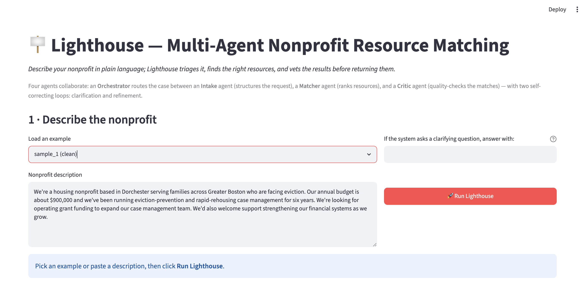

# 🪧 Lighthouse — Multi-Agent Nonprofit Resource Matching

**AI agents that turn a nonprofit's plain-language need into a ranked, vetted packet of funding and partner resources — in seconds.**

> Built at Multi-Agent Orchestration Build Day (AGI House, Cambridge MA, May 2026).

---

## The problem

Small nonprofits lose hours manually hunting for grants, fiscal sponsors, and partner organizations. Discovery is fragmented across dozens of portals and PDFs, so teams routinely miss resources they're actually eligible for — not because the help isn't there, but because finding it is slow and manual.

## What it does

A staff member describes their situation in plain language — who they serve, what they need, how big they are. Lighthouse triages that input into a structured profile, matches it against a resource catalog with reasoned scores, quality-checks the results, and returns a structured resource packet in seconds. When the request is ambiguous or the matches are weak, the system self-corrects before answering.

---

## Architecture

Lighthouse is four agents coordinated by an orchestrator, sharing a single `CaseState` object (`state.py`) that each agent reads from and writes to.

| Agent | Model | Responsibility |
|-------|-------|----------------|
| **Orchestrator** | — (control logic) | Owns shared state, makes routing decisions, runs the two loops, assembles the final packet. |
| **Intake** | `FAST_MODEL` (Claude Haiku) | Free text → structured profile, with self-reported `confidence` and `missing_fields`. |
| **Matcher** | `REASONING_MODEL` (Claude Sonnet) | Ranks the resource catalog with reasoned match scores and eligibility flags. |
| **Critic** | `REASONING_MODEL` (Claude Sonnet) | Reviews the match set and decides `accept` vs. `broaden_and_retry`. |

### The two feedback loops

The orchestration story is in the loops — this is what makes Lighthouse *self-correcting* rather than a single-shot pipeline.

- **Clarification loop** — If a critical field (`geography` / `need_types`) is missing **or** confidence < 0.6, the Orchestrator generates a clarifying question, gets an answer, and re-runs Intake with it folded in. **Capped at one round.**
- **Refinement loop** — If the Critic judges the matches weak, it passes **actionable `broaden_notes`** back to the Matcher for a broadened second pass. **Capped at one retry** — the Critic hard-accepts on the second pass, so the system can never loop indefinitely.

```
                 ┌─────────────────────────────────────────────┐
                 │              ORCHESTRATOR                    │
                 │        (shared state + routing)              │
                 └─────────────────────────────────────────────┘
                                    │
                                    ▼
                            ┌──────────────┐
              ┌────────────▶│    INTAKE     │  free text → profile
              │             └──────────────┘  (+ confidence, missing_fields)
              │                     │
   clarifying │                     ▼
   question   │            missing critical field
   + re-run   │            OR confidence < 0.6 ?
   (×1 max)   └──────────────── yes ┘
                                    │ no
                                    ▼
                            ┌──────────────┐
              ┌────────────▶│    MATCHER    │  rank catalog → scored matches
              │             └──────────────┘
              │                     │
   broaden_   │                     ▼
   notes +    │             ┌──────────────┐
   re-match   │             │    CRITIC     │  accept? or broaden_and_retry?
   (×1 max)   └─── retry ───┤              │
                            └──────────────┘
                                    │ accept
                                    ▼
                          ┌────────────────────┐
                          │  Resource packet    │
                          └────────────────────┘
```

### Model tiering

Intake is high-volume triage, so it runs on the **fast model**; matching and critique are genuine judgment calls, so they run on the **reasoning model**. This isn't just a stated intention — it's visible in the Weave trace's cost/latency:

| Agent | Model | ~Cost | ~Latency |
|-------|-------|-------|----------|
| Intake | Haiku | ~$0.002 | ~2s |
| Matcher | Sonnet | ~$0.03 | ~18s |

The trace shows *why* the reasoning model is reserved for the work that needs it.

---

## Observability (W&B Weave)

Every agent call **and** the orchestrator's routing decisions are traced into a single nested tree: `run_orchestrator` is the parent, with each agent call and its underlying model call nested beneath it.

Because the loops re-invoke agents, **they appear as repeated nodes in the trace** — two `run_intake` calls when clarification fires, two `run_matcher` + two `run_critic` calls when refinement fires. The orchestration is literally visible: you can read the self-correction off the trace tree.

---

## Design decisions

- **`missing_fields` gate, not a confidence threshold.** A live run returned confidence **0.65 — above** our 0.6 threshold — but with `geography` missing. Gating on the scalar alone would have silently matched on incomplete data; the `missing_fields` gate caught it and triggered clarification. Structured calibration beats a single confidence number.
- **No vector DB.** With ~30 resources, the full catalog fits in context, so reasoning over the whole set beats retrieval — no embedding latency, no index to maintain, no retrieval failure modes at this scale.
- **Hallucination guard.** The Matcher validates every `resource_id` against the catalog and drops anything off-catalog, so the Critic's free-text `broaden_notes` (which may name real-world funders) can never leak fake resources into results.
- **Fail-safe loops.** Parse failures default to `accept`, so a malformed model response can never trap the system in an infinite loop.

---

## Stack

Python 3.10+ · Claude (Anthropic API), built with Claude Code · W&B Weave · Pydantic · Rich (CLI) · Streamlit (UI)

---

## Setup & run

Requires Python 3.10+ (Weave's minimum).

```bash
# 1. Virtual environment + dependencies
python3 -m venv venv
source venv/bin/activate          # Windows: venv\Scripts\activate
pip install -r requirements.txt

# 2. Configure secrets
cp .env.example .env              # then edit .env:
#   ANTHROPIC_API_KEY  — https://console.anthropic.com/
#   WANDB_API_KEY      — https://wandb.ai/authorize

# 3. Smoke test (verifies both keys + Weave tracing)
python smoke_test_weave.py
```

### CLI

```bash
# Run a built-in sample
python -m orchestrator --sample sample_1

# Trigger the clarification + refinement loops, answering the question up front
python -m orchestrator --sample sample_5 \
  --answer "We serve Greater Boston, mainly Cambridge and Somerville"

# Use your own free-text description
python -m orchestrator --text "We're a youth arts nonprofit in Cambridge..."
```

| Flag | Description |
|------|-------------|
| `--sample <id>` | Load a description from `data/intake_samples.json` (e.g. `sample_1`). |
| `--text "..."` | Use a raw free-text description (overrides `--sample`). |
| `--answer "..."` | Pre-supplied answer to a clarifying question. **Repeatable**, consumed in order. Without it, an interactive run prompts on the terminal. |

### UI

```bash
streamlit run app.py
```

An animated pipeline view that highlights both loops as they fire, then renders the Understood-As profile, the clarification Q&A, the Critic's vetting, and the recommended-resource cards.

> **Run locally.** API keys stay in `.env` and off the cloud — there is no hosted deployment by design.

---

## Project structure

```
lighthouse/
├── orchestrator.py        # entry point: routing, both loops, packet assembly
├── app.py                 # Streamlit demo UI (pure consumer of the orchestrator)
├── state.py               # CaseState — the shared state model
├── config.py              # models, Weave project, API keys
├── smoke_test_weave.py    # connectivity check (Anthropic + Weave)
├── agents/
│   ├── intake.py          # free text → structured profile
│   ├── matcher.py         # rank the catalog
│   └── critic.py          # accept vs. broaden_and_retry
└── data/
    ├── resources.json     # resource catalog (grants, sponsors, partners, ...)
    └── intake_samples.json# example nonprofit descriptions
```

---

## 📹 Demo

**Video walkthrough (under 2 min):** https://youtu.be/VmxF-vfuJ_g

Two runs end to end — a clean baseline (no loops), then an incomplete input that
triggers both the clarification and refinement loops — followed by the nested
W&B Weave trace and the live Streamlit UI.

### Streamlit UI



Run locally with `streamlit run app.py`.

---

## License

MIT — see [LICENSE](LICENSE).
